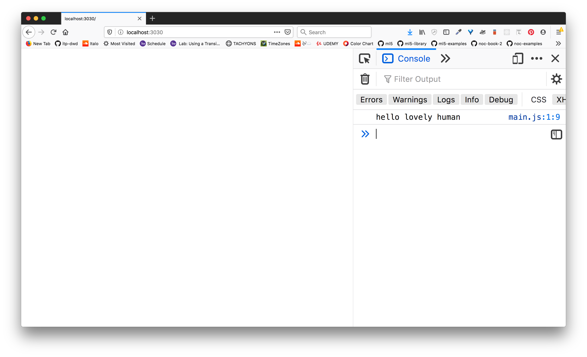

# Step 5: Basic Express App

Now it is time to start adding some server code to our `index.js` file.

## Our roadmap:

Here is a roadmap of what we're going to be filling in here. Notice that the numbers jump around. This is to indicate that this tutorial will be following the steps sequentially, but that we will be jumping around structurally in our file.

```js
/**
* Step 1: Add your node module dependencies
**/


/**
* Step 2: Connect to the db
**/


/**
* Step 3: instantiate the app
**/


/**
* Step 4: Handle CORS Whitelist URLS
**/


/**
* Step 5: Set your middleware
**/


/**
* Step 6: Set the path to your index.html file
**/


/**
* Step 8: Set your posts routes
**/


/**
* Step 9: Set your user routes
**/


/**
* Step 7: create and fire up your server
**/

```

## Start by adding your server dependencies: `index.js`

We begin by using `require()` to the node modules we are going to use:

```js
/**
* Step 1: Add your node module dependencies
**/
const express = require('express');
const http = require('http');
const path = require('path');
const cors = require('cors');
const cookieParser = require('cookie-parser')
const config = require('./config');
const PORT = config.PORT;

/**
* Step 2: Connect to the db
**/

```

So far, we've got nothing super crazy here. We read in: 
* `express`
* `http`
* `cors`
* `cookie-parser`
* `config`

And last we set our `PORT` variable to the port that is defined in the `config` file. 

Ok good. So now we are going to add in our database connection. 

## Connecting to your database: `./db/db.js`

After where we defined the `PORT` variable add in the following lines to `index.js`:

```js
/**
* Step 2: Connect to the db
**/
require('./db/db');

/**
* Step 3: instantiate the app
**/
```

Right now we don't have anything inside that file, but we will now add in the code that allows us to connect to our database. We could easily have added the code that will go in the `db.js` file directly in our `index.js` but this allows us to separate our concerns a bit better.

Now, create a file in `/db` directory called  `db.js`. Your `/db/db.js` file will look like:

```js
const mongoose = require('mongoose');
const config = require('../config');
const MONGODB_URI = config.MONGODB_URI;

mongoose.connect(MONGODB_URI, {useNewUrlParser:true, 
  useCreateIndex: true, useUnifiedTopology: true});
```

As you can see, our `db.js` file has the instructions for our server to use the `mongoose` module to connect to our MongoDB database which is running at the defined `MONGODB_URI`.

***
***
***
## Rest Stop:

At this point we've:
* Read in our node module dependencies and added a connection to our mongodb.

***
***
***

Excellent. Now we can create a new express app instance. 

## The Simplest Express App

The following code is our "simplest" express app. We will: 
* instantiate an express instance
* get the path to our `public` directory to serve our client-side code and static files
* create a placeholder for whitelisted URLS that allow for CORS in case you decide to host your client elsewhere. This should be an issue for us since we're building our application in our `public` directory and we are not going to have any issues with CORS here.
* set our express middleware with some default usual settings
* send the index.html file living in our `public` directory (we will make an index.html file!)
* and last, we will create our server and set it to listen to the given `PORT` number.

Pick up where we left off in our `index.js` file, add the following:

```js
/**
* Step 3: instantiate the app
**/
const app = express();
const publicPath = path.resolve(__dirname, 'public');

/**
* Step 4: Handle CORS Whitelist URLS
* This step could probably be skipped since 
* our client is hosted from the same origin
* but I'll leave this in here for now!
**/
let whitelist;
if (process.env.NODE_ENV === 'production') {
    whitelist = [
      // add production urls
    ]
} else {
    whitelist = [
        // add development urls
    ]
}

const corsOptions = {
    origin: function (origin, callback) {
        if (whitelist.indexOf(origin) !== -1 || !origin) {
            callback(null, true)
        } else {
            // callback(new Error('Not allowed by CORS'))
            callback(null, false)
        }
    },
    credentials:true
}


/**
* Step 5: Set your middleware
**/
app.use(cookieParser())
app.use(cors(corsOptions));
app.use(express.json());
app.use(express.urlencoded({extended:true}));
app.use(express.static(publicPath));

/**
* Step 6: set the path to your index.html file
**/
app.get("/", (req, res) => {
  res.sendFile('/')
})


/**
* Step 8: Set your link data routes
**/


/**
* Step 9: Set your user routes
**/


/**
* Step 7: create and fire up your server
**/
http.createServer(app).listen(PORT, () => {
  console.log(`see the magic at: http://localhost:${PORT}`)
})

```


## Create a file: `public/index.html`

In the `public` directory, add an `index.html` file that will contain our client side code. 

In that `public/index.html` file, include the following boilerplate code:

```html
<!DOCTYPE html>
<html lang="en">
  <head>
    <meta charset="utf-8" />
    <meta http-equiv="x-ua-compatible" content="ie=edge" />
    <meta name="viewport" content="width=device-width, initial-scale=1" />

    <title></title>

    <link rel="stylesheet" href="css/main.css" />
    <link rel="icon" href="images/favicon.png" />
  </head>

  <body>
    <script src="js/main.js"></script>
  </body>
</html>

```

Please also create the following files:
* `public/js/main.js`
* `public/css/main.css`

In `public/js/main.js`, put a `console.log` just so we know it is working:

```js
console.log('hello lovely human')
```


## Fire up your app

Now you can start your server and see if our app is running!

In your terminal:
```sh
node index.js
```

Since we want to be super cool fancy developers, let's use `nodemon` to re-start our server whenever we make any changes:

Use `npm install -D` to install to devDependencies:
```sh
npm install -D nodemon 
```

Now we can do:

```sh
nodemon index.js
```

Even better however is to add the following to the `scripts` of our `package.json`:

```json
"scipts":{
  "start": "node index.js",
  "dev": "nodemon index.js"
}
```

So now we can just do:

```sh
npm run dev
```

And if you go to: `http://localhost:3030`, and open up your console, you should see:




## Check in to git
Add this to git:

```sh
git add .
git commit -m "adds basic express app"
```

***
***
***
## Rest Stop:

At this point you've:
* created a basic express app that serves up your `index.html` file at the route `http://localhost:3030`
* connected your app to mongodb

***
***
***

Now that your app is set up, it is now time to set up the CRUD routes for your `links` and `user` data.

Continue onto the next step:
* ↳ [Step 6: CRUD posts routes](/06_posts-routes.md)


