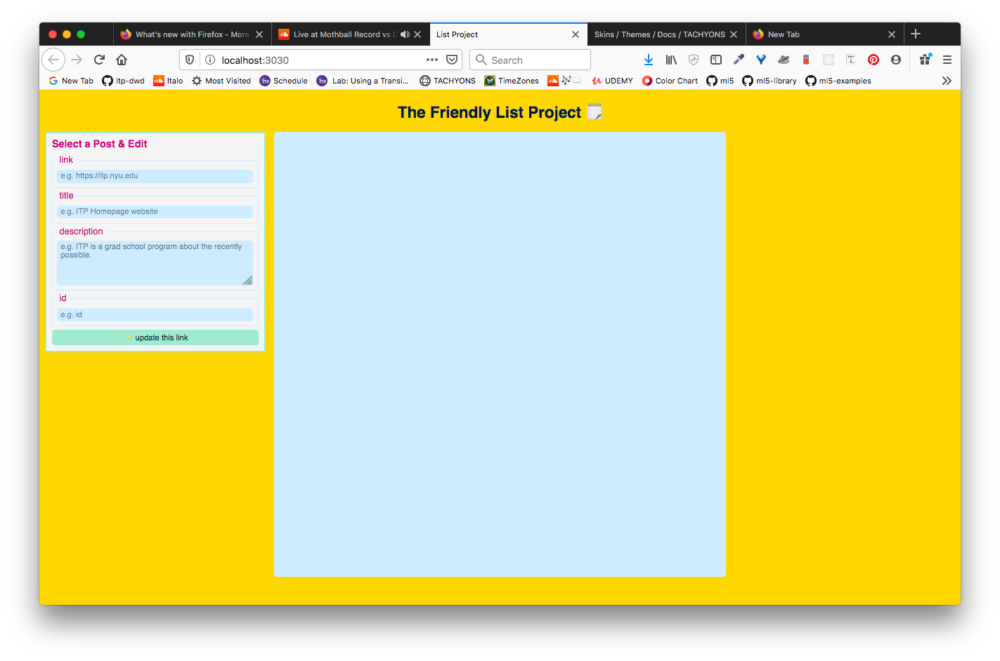
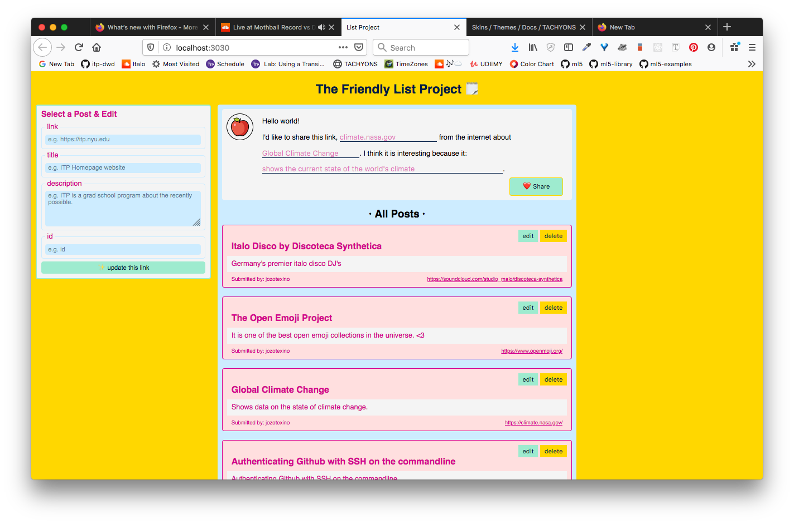
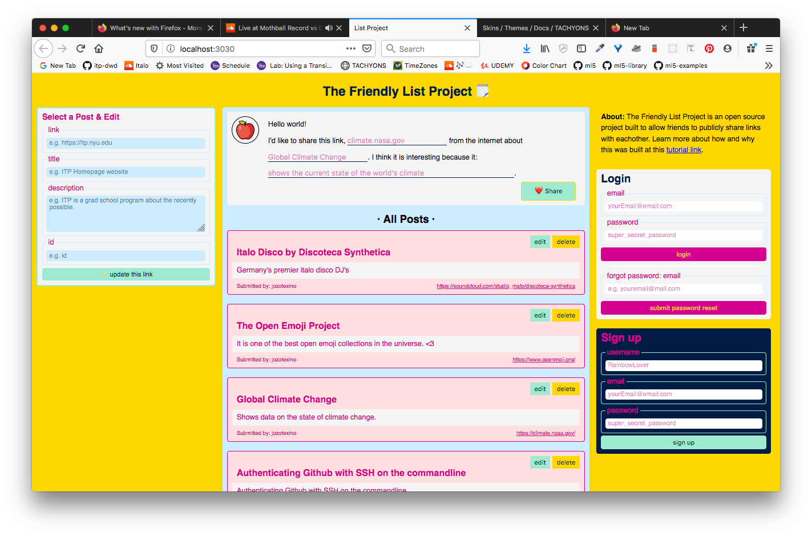

# Step 13: Front end setup and planning

Alright, if you've made it this far, kudos! You covered a lot of ground. Now you're going to build the front end to the list project. 

For the purpose of this exercise, we're going to stick to plain HTML5. We won't be using any express templating engine or any of the slick new front end frameworks like Vue.js or React.js. Maybe one day I'll make a version w/ vue.js (or link to another project that showcases the setup with those frameworks). For now, you're going to do this with the raw, vanilla HTML/JavaScript.

## A note on Styling

For the purpose of this tutorial I won't be covering the css styling. You're more than welcome to have a look at all the `main.css` file that contains all of the css styles for the list project, but in general the focus here is the mechanics of setting up this project rather than the layout and styling. 

I will be following the BEM style convention of CSS class naming to the best of my ability (but there will definitely be some places where I take some some liberties 😉).

You can find the complete stylesheet here: 
[Link to CSS stylesheet for the frontend]()

## Font end goals:

At the end of this exercise this is what our page will look like:


We will have two view routes:
* `/`
* `/reset_password`

## Roadmap

Before you begin, take the time to make some comments in your HTML to define the sections of your `index.html` page. 

Here is a commented version of the html:

```html
<!DOCTYPE html>
<html lang="en">
  <head>
    <meta charset="utf-8" />
    <meta http-equiv="x-ua-compatible" content="ie=edge" />
    <meta name="viewport" content="width=device-width, initial-scale=1" />

    <title>List Project</title>

    <link rel="stylesheet" href="css/main.css" />
    <link rel="icon" href="images/favicon.png" />
  </head>

  <body>
    <div id="app">
    <!-- =====================================
        TODO: section: header 
      ===================================== -->

    <!-- =====================================
        TODO: section: main 
      ===================================== -->

        <!-- //////////////////////////////////// 
          TODO: subsection: editor 
        //////////////////////////////////// -->

        
        <!-- //////////////////////////////////// 
          TODO: subsection: posts 
        //////////////////////////////////// -->

        
        <!-- //////////////////////////////////// 
          TODO: subsection: nav 
        //////////////////////////////////// -->

    </div>
    <!-- JS Scripts -->
    <!-- TODO: Posts class -->
    <script src="js/Posts.js"></script>
    <!-- TODO:  Login class -->
    <script src="js/Login.js"></script>
    <!-- TODO:  Signup class -->
    <script src="js/Signup.js"></script>
    <!-- main script -->
    <script src="js/main.js"></script>
  </body>
</html>
```

Notice we wrap everything in a div with an `id="app"`.

Here in our `scripts` we add in the following references. They will be empty for now, but we will create them and add javascript to them to allow us to handle our client side interactions: 
* `Posts.js`
* `Login.js`
* `Signup.js`


## 13.2: A Simple header section

Let's start with the header section

```html
<!-- =====================================
  section: header 
===================================== -->
<header class="header">
  <h1 class="header__title">
    <a class="header__title-link" href="/">The Friendly List Project 🗒</a>
  </h1>
</header>
```


## 13.3: laying out the Main section

In our main section let's layout the main block, the subsections, and the subsubsections that we are going to fill in.

In our `main` element we are going to have the following:
```
main
  ↳ editor
    ↳ form to edit existing posts
  ↳ posts
    ↳ form to submit new posts
    ↳ list of posts
  ↳ nav
    ↳ about section
    ↳ login form
    ↳ signup form
```

```html
 <!-- =====================================
        section: main 
      ===================================== -->
      <main class="main">
        <!-- //////////////////////////////////// 
          subsection: editor 
        //////////////////////////////////// -->
        <aside class="editor">
          
        </aside>
        <!-- //////////////////////////////////// 
          subsection: posts 
        //////////////////////////////////// -->
        <section class="posts">
          <!-- posts submit -->
          

          <!-- posts view -->
          
        </section>
        <!-- //////////////////////////////////// 
          subsection: nav 
        //////////////////////////////////// -->
        <nav class="nav">
          <!-- about description -->
          

          <!-- login form -->
          

          <!-- signup form -->
          
          
        </nav>
        <!-- end .nav-->
      </main>
      <!-- end .main-->
```

## 13.4: Filling in the editor section

```html
<!-- //////////////////////////////////// 
          subsection: editor 
        //////////////////////////////////// -->
        <aside class="editor">
          <section class="editor__post-editor">
            <h3 class="editor__post-editor__title">Select a Post & Edit</h3>
            <form class="form post__form-edit">
              <!-- input for link -->
              <fieldset class="form__section">
                <legend class="form__section__title">link</legend>
                <input
                  class="form__input form__input--text"
                  type="text"
                  name="link"
                  placeholder="e.g. https://itp.nyu.edu"
                />
              </fieldset>
              <!-- input for title -->
              <fieldset class="form__section">
                <legend class="form__section__title">title</legend>
                <input
                  class="form__input form__input--text"
                  type="text"
                  name="title"
                  placeholder="e.g. ITP Homepage website"
                />
              </fieldset>
              <!-- input for description -->
              <fieldset class="form__section">
                <legend class="form__section__title">description</legend>
                <textarea
                  class="form__input form__input--textarea"
                  name="description"
                  placeholder="e.g. ITP is a grad school program about the recently possible."
                ></textarea>
              </fieldset>
              <!-- input for id -->
              <fieldset class="form__section">
                <legend class="form__section__title">id</legend>
                <input
                  class="form__input form__input--text"
                  type="text"
                  name="id"
                  placeholder="e.g. id"
                />
              </fieldset>
              <input
                class="form__input form__input--button form__input--button--edit"
                type="submit"
                value="✨ update this link"
              />
            </form>
          </section>
        </aside>
```

As you can see there's a form that is divided using the `fieldset` tag:




## 13.5.1: Filling in the posts section - part 1: the form

Here we add in the form to submit new posts.

```html
        <!-- //////////////////////////////////// 
          subsection: posts 
        //////////////////////////////////// -->
        <section class="posts">
          <!-- posts submit -->
          <section class="posts__submit">
            <div class="posts__submit__avatar">
              
            </div>
            <form class="form post__form-new">
              <p class="post__form-new__prompt">
                Hello world! <br />
                I'd like to share this link,
                <input
                  class="form__input--text--inline"
                  type="text"
                  name="link"
                  placeholder="climate.nasa.gov"
                />
                from the internet about
                <input
                  class="form__input--text--inline"
                  type="text"
                  name="title"
                  placeholder="Global Climate Change"
                />. I think it is interesting because it:
                <input
                  class="form__input--text--inline form__input--text--inline--long"
                  type="text"
                  name="description"
                  placeholder="shows the current state of the world's climate"
                />.
              </p>
              <input
                class="form__input--button--right"
                type="submit"
                value="❤️ Share"
              />
            </form>
          </section>
          <!-- posts view -->
          
        </section>
```


## 13.5.2: Filling in the posts section - part 2: the list section

```html
          <!-- posts view -->
          <section class="posts__view">
            <h3 class="posts__view__title">· All Posts ·</h3>
            <ul class="posts__view__list">
              <!-- this is where your posts will be filled in with javascript -->
            </ul>
          </section>
```



## Review - Step 13.5: subsection posts in it's entirety

```html
<!-- //////////////////////////////////// 
          subsection: posts 
        //////////////////////////////////// -->
        <section class="posts">
          <!-- posts submit -->
          <section class="posts__submit">
            <div class="posts__submit__avatar">
              
            </div>
            <form class="form post__form-new">
              <p class="post__form-new__prompt">
                Hello world! <br />
                I'd like to share this link,
                <input
                  class="form__input--text--inline"
                  type="text"
                  name="link"
                  placeholder="climate.nasa.gov"
                />
                from the internet about
                <input
                  class="form__input--text--inline"
                  type="text"
                  name="title"
                  placeholder="Global Climate Change"
                />. I think it is interesting because it:
                <input
                  class="form__input--text--inline form__input--text--inline--long"
                  type="text"
                  name="description"
                  placeholder="shows the current state of the world's climate"
                />.
              </p>
              <input
                class="form__input--button--right"
                type="submit"
                value="❤️ Share"
              />
            </form>
          </section>
          <!-- posts view -->
          <section class="posts__view">
            <h3 class="posts__view__title">· All Posts ·</h3>
            <ul class="posts__view__list">
              <!-- this is where your posts will be filled in with javascript -->
            </ul>
          </section>
        </section>
```

## Step 13.6: the nav section 

The nav section includes our:
* about section
* login form
* forgot password form
* signup form


```html
<!-- //////////////////////////////////// 
          subsection: nav 
        //////////////////////////////////// -->
        <nav class="nav">
          <!-- about description -->
          <section class="nav__section nav__section-description">
            <p class="nav__section-description-text">
              <span>About:</span> The Friendly List Project is an open source
              project built to allow friends to publicly share links with
              eachother. Learn more about how and why this was built at this
              <a href="#">tutorial link</a>.
            </p>
          </section>
          <!-- logout button -->
          <section class="nav__section nav__section-logout">
            <p class="nav__section-logout__text">
            <span>I want to </span><button class="form__input--button--pink" id="logout-button">logout</button>
            </p>
          </section>
          <!-- login form -->
          <section class="nav__section nav__section-login">
            <h2 class="nav__section__title">Login</h2>
            <section class="nav__section-login__login">
              <form class="form login__form">
                <fieldset class="form__section login__form__section">
                  <legend class="form__section__title">email</legend>
                  <input
                    class="form__input form__input--grey"
                    type="email"
                    name="email"
                    placeholder="yourEmail@email.com"
                  />
                </fieldset>
                <fieldset class="form__section login__form__section">
                  <legend class="form__section__title">password</legend>
                  <input
                    class="form__input form__input--grey"
                    type="password"
                    name="password"
                    placeholder="super_secret_password"
                  />
                </fieldset>
                <input
                  class="form__input--button form__input--button form__input--button--pink"
                  type="submit"
                  value="login"
                />
              </form>
            </section>
            <section><hr></section>
            <section class="nav__section-login__forgot">
              <form class="form forgot__form">
                <fieldset class="form__section">
                  <legend class="form__section__title">
                    forgot password: email
                  </legend>
                  <input
                    class="form__input form__input--grey"
                    type="email"
                    name="email"
                    placeholder="e.g. youremail@mail.com"
                  />
                </fieldset>
                <input
                  class="form__input--button form__input--button--pink"
                  type="submit"
                  value="submit password reset"
                />
              </form>
            </section>
          </section>
          <!-- signup form -->
          <section class="nav__section nav__section-signup">
            <h2 class="nav__section__title nav__section__title--light">
              Sign up
            </h2>
            <section class="nav__section-signup__signup">
              <form class="form signup__form">
                <fieldset class="form__section form__section--mint">
                  <legend class="form__section__title">username</legend>
                  <input
                    class="form__input form__input--grey"
                    type="text"
                    name="username"
                    placeholder="RainbowLover"
                  />
                </fieldset>
                <fieldset class="form__section form__section--mint">
                  <legend class="form__section__title">email</legend>
                  <input
                    class="form__input form__input--grey"
                    type="email"
                    name="email"
                    placeholder="yourEmail@email.com"
                  />
                </fieldset>
                <fieldset class="form__section form__section--mint">
                  <legend class="form__section__title">password</legend>
                  <input
                    class="form__input form__input--grey"
                    type="password"
                    name="password"
                    placeholder="super_secret_password"
                  />
                </fieldset>
                <input
                  class="form__input--button form__input--button--mint"
                  type="submit"
                  value="sign up"
                />
              </form>
            </section>
          </section>
        </nav>
        <!-- end .nav-->
```




## Add and Commit your changes

```
git add .
git commit -m "adds markup to index.html"
```

***
***
***
## Rest Stop:

At this point you've:
* completed adding the hmtml markup for our main client side UI.

***
***
***


Continue onto the next step:
* ↳ [Step 14: the Signup class](/14_signup-js.md)

