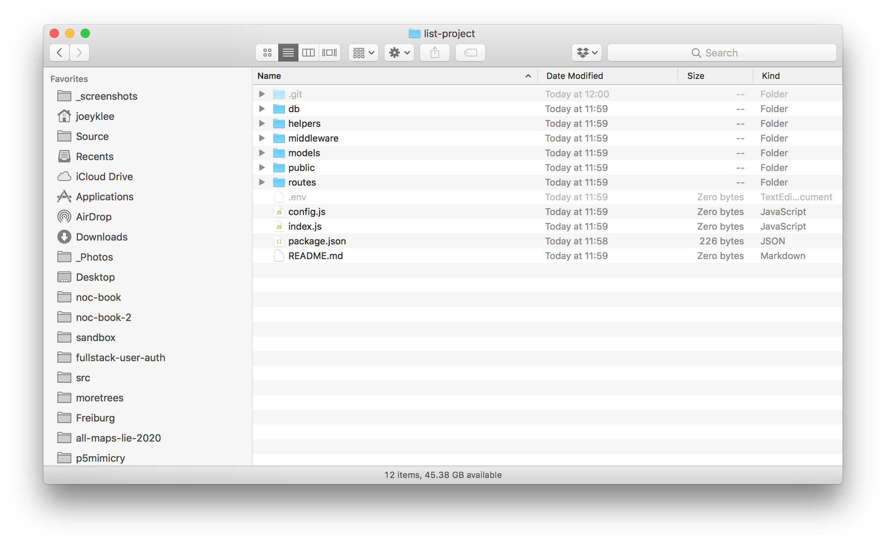

# Fullstack User Authentication and Authorization Tutorial w/ Node.js/Express.js, MongoDB, and JWT
Tutorial on user authentication and authorization with node.js/express.js, Mongodb, JSONWebTokens, Cookies and HTML5

## Pre-requisites
* Level: intermediate - advanced
* Requirements: working/proficient knowledge of node.js, express.js, mongodb, and HTML5. I will be assuming some knowlege of these tools, but will try to make things as clear as possible.
* Adapted from: https://medium.com/swlh/jwt-authentication-authorization-in-nodejs-express-mongodb-rest-apis-2019-ad14ec818122

## About

If you're here, this is probably the situation you've found yourself in -- you're building a web application and you want people to be able to **signup**, **log-in**/**log out**, and have **permissions** to **view**, **add**, **edit** and **delete** data.

If this sounds relevant, then keep reading, you're in the right place!

This tutorial is about setting up the following:

* **On the server side**: We will set up CRUD (create, read, update, delete) API endpoints and express middleware that allow us to do:
  * **authentication**: 
    * Authentication in web applications is about creating the ability to verify *who* someone is. This means that in our database we will have a collection of users that people can join through a simple user registration process. 
  * **authorization**: 
    * Authorization in web applications is about defining what people are *allowed* to do in the application. Generally this means *checking* to see who someone is and then *allowing* them **permissions** to log in, create, edit, and delete data. 
* **On the client side**: we will set up the necessary HTML and javascript that will allow us to communicate with our server so that people can be:
  * **authenticated**:
    * For the client side, this means that people will be able to create a new account. For the rest of this tutorial we will call this the **user registration**. 
    * This will be achieved by:
      * HTML: a simple HTML `<form>` element that allows people to submit a **username**, **password**, and **email**.
      * JavaScript: submitting the `<form>` will trigger a `POST` request using HTTP that will take the inputs from the form and send them to your server's **authentication** API endpoints.
  * **authorized**:
    * For the client side, this means that once people are **authenticated** and they have been added as a user to the collection of users in your database, people will now have the ability to:
      * **login**:
        * this will take the form of:
          * HTML: a simple `<form>` that allows people to add their **email** address and **password** so they can be **authorized** to create, read, edit, and delete data in the application.
          * JavaScript: submitting the `<form>` will trigger a `POST` request using HTTP that will take the inputs from the form and send them to your server's **authorization** API endpoint. If successful, a `cookie` with a `JSON Web Token` (JWT) will be sent from your server to the browser and be stored. Any subsequent requests will include this `JWT` as credentials indicating to your server who the user is. 
      * **logout**:
        * this will take the form of:
          * HTML: a button
          * JavaScript: when the button is clicked, a `POST` request will be triggered that tells the server: If a person is logged in, log them out by removing the `JWT` stored as a cookie from the browser.
      * **Ask to reset their password**
        * this will take the form of:
          * HTML: a form that allows people to submit their **email** address and receive a unique *verification token* allowing them to create a new password.
          * JavaScript: when the `<form` is submitted, a `POST` request with the **email** be triggered that tells the server: "Hey, look up this email address, generate a new `JWT`, and send it to their email address. The email will have a URL that links back to your application allowing them to submit a new password (see next point).
      * **Submit a new password**
        * this will take the form of:
          * HTML: a form that allows people to submit their **new desired password** and the `JWT` sent in the email to verify that they are indeed the same person updating the password.
          * JavaScript: when the `<form` is submitted, a `POST` request with the **new password** and `JWT` be triggered that tells the server: "Hey, look up this `JWT` and see which user account it matches up with. Once you find it, reset their **old password** with the **new password** they have just submitted. 
      * **View existing data**
      * **Create new data**
      * **Edit data**
      * **Delete data**

As you can see, there are a number of components that need to come together that make this all possible. Here's a high-level overview of what this means. We need to set up

* A **database**:
  * We will be using **MongoDB**
* A **server**:
  * We will be using **Node.js/Express.js** and create an API that allows us to pass messages between your client and database.
* A **client**:
  * We will be using plain **HTML** and vanilla **javascript** that will allow people to interact with your application.

Now that you've got an overview of the situation, let's get setup.

***

# The List Project

For this project, we are going to build a social link sharing application that allows you and your friends to share interesting links from across the web in one place. The project will be comprised of the following components:

* A
* B
* C
* D

## Pre-Setup & Installation

The following instructions are for `macOS` which is the operating system I'm running. If you're a windows user, I'd love your contribution on how to setup these dependencies ❤.

### Install Homebrew

```sh
/usr/bin/ruby -e "$(curl -fsSL https://raw.githubusercontent.com/Homebrew/install/master/install)"
```

### Install Node.js with NVM

```sh
# use homebrew to install nvm
brew install nvm

# make a directory for nvm
mkdir ~/.nvm/
```

open your `.bash_profile` or create a file in your `~/.bash_profile` and include the following:

```txt
export NVM_DIR=~/.nvm
source $(brew --prefix nvm)/nvm.sh
```

Check to see if nvm is working:

```sh
nvm ls
```

This will list a which node versions are currently installed. If none are installed then you'll see a bunch of `N/A`s.

Now install node version `v10.15.0` which is what this tutorial was built on:

```sh
nvm install 10.15.0
```

And now you can set it to default to that version:

```sh
nvm alias default 10.15.0
```

via: https://www.chrisjmendez.com/2018/02/07/install/

NOTE: At the time of this writing, I would avoid node versions less thatn`10.0` since many services are beginning to deprecate their support for those versions.

### Install MongoDB

```sh
brew install mongodb
```

If this is your first time installing mongodb, you'll need to create directory for your database and also make sure to give your machine the proper read/write permissions. Do this by:

```sh
# go to your root
cd 
# make a directory called data/db
mkdir -p /data/db

# use `sudo chown` to set the permissions
sudo chown -R `id -un` /data/db
```

And voila! You can now start your mongodb by running:
```sh
mongod
```

and stopping mongo by pressing the following in the same terminal window: `ctl` + `c` 

If you'd like to have visual interface for the mongodb I can recommend:
* Robo3T: https://robomongo.org/download

***
***
***

## Rest Stop: 
So far we have:
* Installed all of our major dependencies:
  * node.js
  * mongodb

If these are not installed, please make sure to take care before proceeding.

***
***
***

## Setup

We are going to start from null, zero, nada, nothing, a blank canvas onto which we will make our masterpiece. 

Fire up your terminal window and and make a new project folder:

```sh
cd  ~/your/preferred/parent/directory
mkdir list-project
```

Change into the `/list-project` directory:

```sh
cd list-project
```

Now we will create our application directory structure. It is going to look like this:

```
README.md
config.js
index.js
package.json
.env
/db
/helpers
/middleware
/models
/public
/routes
/node_modules
```

where:
* README.md
  * *FILE*: Our readme file that explains how to set up your project, documentation, etc
* config.js:
  * *FILE*: This is where  
* index.js:
  * *FILE*: where our main node.js/express server code will live
* package.json:
  * *FILE*: This is where our node application information is stored.
* .env:
  * *FILE*: This is where we will hide our secret application information.
* /db
  * *DIRECTORY*: the directory that has the information regarding our mongodb database  
* /helpers
  * *DIRECTORY*: the directory where any handy helper functions will live
* /middleware
  * *DIRECTORY*: the directory where our express middleware will live
* /models
  * *DIRECTORY*: the directory where our mongodb data model schemas will live
* /public
  * *DIRECTORY*: the directory where our client side code will live
* /routes
  * *DIRECTORY*: the directory where our API routes for our `users` and `links`.
* /node_modules
  * *DIRECTORY*: the directory where npm will install all our application dependencies

For short, you can do the following:

```sh
# initialize the project as a git repo
git init

# create a package.json and initialize with all defaults
npm init -y

# create the files
touch README.md config.js index.js .env

# create the directories
mkdir db helpers middleware models public routes
```



Now that we've scaffolded our project directory, it is time to start filling in our project.

***
***
***
## Rest Stop:

At this point we've:
* scaffolded out our application with the main files in our root directory and main folders which will help us organize our project files.


***
***
***