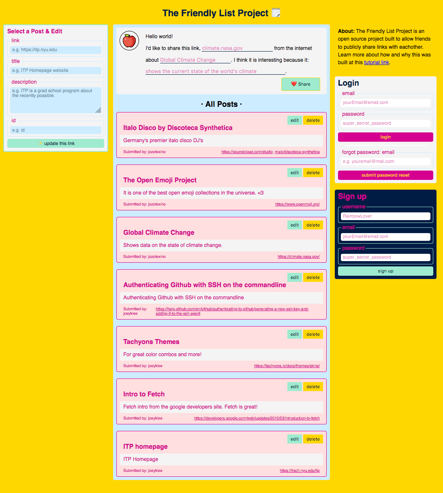

# Fullstack User Authentication and Authorization Tutorial w/ Node.js/Express.js, MongoDB, and JWT
Tutorial on user authentication and authorization with node.js/express.js, Mongodb, JSONWebTokens, Cookies and HTML5

## Pre-requisites
* Level: intermediate - advanced
* Requirements: working/proficient knowledge of node.js, express.js, mongodb, and HTML5. I will be assuming some knowlege of these tools, but will try to make things as clear as possible.
* Adapted from: https://medium.com/swlh/jwt-authentication-authorization-in-nodejs-express-mongodb-rest-apis-2019-ad14ec818122

## Acknowledgements

* ITP at NYU for their support 
* The tutorial which this is based off of:https://medium.com/swlh/jwt-authentication-authorization-in-nodejs-express-mongodb-rest-apis-2019-ad14ec818122
* The tutorials by Tania Rascia: https://www.taniarascia.com
* The OpenSource community
* Tachyons.io for color inspiration
* Discoteca Synthetica for the music that was played while making this. https://soundcloud.com/studio_malo/discoteca-synthetica
* And you!

## About

If you're here, this is probably the situation you've found yourself in -- you're building a web application and you want people to be able to **signup**, **log-in**/**log out**, and have **permissions** to **view**, **add**, **edit** and **delete** data.

If this sounds relevant, then keep reading, you're in the right place!

This tutorial is about setting up the following:

* **On the server side**: We will set up CRUD (create, read, update, delete) API endpoints and express middleware that allow us to do:
  * **authentication**: 
    * Authentication in web applications is about creating the ability to verify *who* someone is. This means that in our database we will have a collection of users that people can join through a simple user registration process. 
  * **authorization**: 
    * Authorization in web applications is about defining what people are *allowed* to do in the application. Generally this means *checking* to see who someone is and then *allowing* them **permissions** to log in, create, edit, and delete data. 
* **On the client side**: we will set up the necessary HTML and javascript that will allow us to communicate with our server so that people can be:
  * **authenticated**:
    * For the client side, this means that people will be able to create a new account. For the rest of this tutorial we will call this the **user registration**. 
    * This will be achieved by:
      * HTML: a simple HTML `<form>` element that allows people to submit a **username**, **password**, and **email**.
      * JavaScript: submitting the `<form>` will trigger a `POST` request using HTTP that will take the inputs from the form and send them to your server's **authentication** API endpoints.
  * **authorized**:
    * For the client side, this means that once people are **authenticated** and they have been added as a user to the collection of users in your database, people will now have the ability to:
      * **login**:
        * this will take the form of:
          * HTML: a simple `<form>` that allows people to add their **email** address and **password** so they can be **authorized** to create, read, edit, and delete data in the application.
          * JavaScript: submitting the `<form>` will trigger a `POST` request using HTTP that will take the inputs from the form and send them to your server's **authorization** API endpoint. If successful, a `cookie` with a `JSON Web Token` (JWT) will be sent from your server to the browser and be stored. Any subsequent requests will include this `JWT` as credentials indicating to your server who the user is. 
      * **logout**:
        * this will take the form of:
          * HTML: a button
          * JavaScript: when the button is clicked, a `POST` request will be triggered that tells the server: If a person is logged in, log them out by removing the `JWT` stored as a cookie from the browser.
      * **Ask to reset their password**
        * this will take the form of:
          * HTML: a form that allows people to submit their **email** address and receive a unique *verification token* allowing them to create a new password.
          * JavaScript: when the `<form` is submitted, a `POST` request with the **email** be triggered that tells the server: "Hey, look up this email address, generate a new `JWT`, and send it to their email address. The email will have a URL that links back to your application allowing them to submit a new password (see next point).
      * **Submit a new password**
        * this will take the form of:
          * HTML: a form that allows people to submit their **new desired password** and the `JWT` sent in the email to verify that they are indeed the same person updating the password.
          * JavaScript: when the `<form` is submitted, a `POST` request with the **new password** and `JWT` be triggered that tells the server: "Hey, look up this `JWT` and see which user account it matches up with. Once you find it, reset their **old password** with the **new password** they have just submitted. 
      * **View existing data**
      * **Create new data**
      * **Edit data**
      * **Delete data**

As you can see, there are a number of components that need to come together that make this all possible. Here's a high-level overview of what this means. We need to set up

* A **database**:
  * We will be using **MongoDB**
* A **server**:
  * We will be using **Node.js/Express.js** and create an API that allows us to pass messages between your client and database.
* A **client**:
  * We will be using plain **HTML** and vanilla **javascript** that will allow people to interact with your application.

Now that you've got an overview of the situation, let's get setup.

***

# Step-by-step: The List Project

For this project, we are going to build a social link sharing application that allows you and your friends to share interesting links from across the web in one place. 

If you want to see the full thing, see: 
* https://github.com/joeyklee/list-project

## Getting Started - installation

The first stop on our development journey will be to install our required software. You can begin by following this link:
* ↳ [Part 1: installation](tutorial/01_installation.md)

